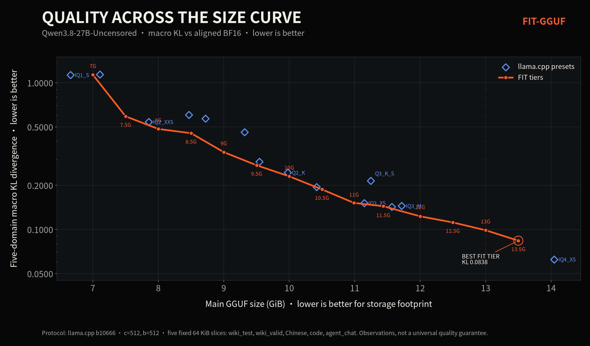

<p align="center">
  <picture>
    <source media="(prefers-color-scheme: dark)" srcset="branding/fit-gguf-logo-dark.svg">
    <source media="(prefers-color-scheme: light)" srcset="branding/fit-gguf-logo-light.svg">
    
  </picture>
</p>

<p align="center"><strong>Fit-to-Size Intelligent Tensor Quantization for GGUF</strong></p>

<p align="center">
  A deterministic planning layer that turns llama.cpp quantization presets into a near-continuous model-size control.
</p>

## The short version

Standard GGUF quantization asks you to choose a preset. FIT-GGUF starts from
the largest supported preset below a requested byte budget, then spends the
remaining bytes on deterministic tensor-level precision upgrades.

> **Traditional GGUF gives you presets. FIT gives you a size slider.**

FIT-GGUF v0.1 has two deliberately separate conclusions:

| Claim | Status | Scope |
| --- | --- | --- |
| Deterministic size prediction and recipe execution | **Validated** | 22/22 evaluated targets across two tested model families had zero-byte actual-vs-predicted error under the pinned toolchain; the current 14-tier release also matched its post-oracle predictions exactly. |
| Universally optimal tensor allocation | **Not established** | The imatrix-guided allocator helped on the development family but did not outperform matched random allocation on the second family. FIT claims precise size control, not a universal quality optimum. |

“Continuous” means arbitrary targets within the representable GGUF recipe
space. Tensor/qtype transitions are discrete, so a small amount of target
slack may remain. The predictor is required to match the resulting artifact;
it does not pretend that every byte target is exactly representable.

## First release: Qwen3.8-27B-Uncensored

The first public batch contains **14 FIT tiers from 7 GiB to 13.5 GiB in
0.5-GiB steps**, produced from
[`orcarouter/Qwen3.8-27B-Uncensored`](https://huggingface.co/orcarouter/Qwen3.8-27B-Uncensored).
Every tier includes its plan, effective recipe, tensor override file, measured
five-domain KL/Same-top results, and SHA-256 provenance.



[English chart](docs/assets/kl-curve-en.png) · [中文图表](docs/assets/kl-curve-zh.png)

The curve is an empirical observation for this model and protocol, not a
general guarantee. P5 replaced the K-spanning 12.5-13.5G recipes with the
IQ3_M-to-IQ4_XS span; P6 repaired the 8-10G spans. The final measured FIT
curve is monotonic across all 14 release tiers, while the superseded recipes
remain retained as experiment evidence.

Additional release charts:

- Same-top agreement: [English](docs/assets/sametop-curve-en.png) · [中文](docs/assets/sametop-curve-zh.png)
- Old-to-final allocation comparison: [English](docs/assets/strategy-improvement-en.png) · [中文](docs/assets/strategy-improvement-zh.png)
- Target-budget utilization: [English](docs/assets/target-utilization-en.png) · [中文](docs/assets/target-utilization-zh.png)

## Install

FIT-GGUF requires Python 3.11+ and a compatible llama.cpp runtime containing
`llama-quantize`.

```bash
python3 -m venv .venv
source .venv/bin/activate
python -m pip install -e '.[test]'
python -m pytest tests/
```

The Python package itself has no runtime dependencies outside the standard
library. Real analysis and quantization use the supplied llama.cpp binary.

## CLI workflow

### 1. Analyze a source/preset interval

```bash
fit analyze \
  --source model-BF16.gguf \
  --imatrix imatrix.gguf \
  --runtime /path/to/llama.cpp/bin \
  --lower IQ3_M \
  --upper IQ4_XS \
  --out-dir work/analysis
```

`analyze` captures the effective preset recipes with pinned
`llama-quantize --dry-run`, profiles the imatrix, derives GGUF metadata and
freezes the candidate set.

### 2. Plan an explicit byte target

```bash
fit plan \
  --analysis work/analysis/analysis.json \
  --target-bytes 12884901888 \
  --policy balanced \
  --model-name MyModel \
  --out-prefix work/MyModel-FIT-12G
```

This writes a plan record, effective recipe and `--tensor-type-file`. Planning
is deterministic for fixed inputs, policy and toolchain.

### 3. Quantize and enforce the prediction

```bash
fit quantize \
  --analysis work/analysis/analysis.json \
  --tensor-types work/MyModel-FIT-12G-tensor-types.txt \
  --out MyModel-FIT-12G.gguf \
  --expect-bytes PREDICTED_BYTES_FROM_THE_PLAN
```

The command rejects a size mismatch and records the output SHA-256.

## How it works

1. **Anchor** — select the largest supported lower preset whose predicted
   artifact fits the budget.
2. **Measure** — derive tensor shapes, effective qtypes, encoded byte deltas
   and imatrix statistics from the actual source/toolchain.
3. **Allocate** — rank safe positive-precision transitions and pack them under
   the remaining byte budget using a frozen policy.
4. **Ask the oracle** — replay the proposed tensor override file through
   llama.cpp dry-run so counter-based preset rules are reflected in the final
   effective recipe.
5. **Verify** — quantize, check the artifact byte size against the oracle
   prediction, and hash the result.

This architecture matters because llama.cpp presets are recipes, not a single
qtype applied uniformly to every tensor.

## Evidence and reproducibility

- `FINAL_REPORT.md` — v0.1 conclusions, accepted claims and rejected claims.
- `experiments/` — frozen experiment inputs, gates, logs and machine-readable
  results from M0–M16 and productization stages.
- `experiments/2026-08-29-p4-release-batch/` — the first 14-tier release batch.
- `src/fit_gguf/` — parser, GGUF size model, imatrix profiler, planner,
  optimizer and CLI.
- `tests/` — deterministic unit and integration-level coverage.

The published measurements use llama.cpp b10666 (`4e97ac86e`), Linux x86_64,
ROCm, 512-token context, 512 batch size, aligned BF16 references and five fixed
64 KiB slices (`wiki_test`, `wiki_valid`, Chinese, code and `agent_chat`). KL
and Same-top are primary directional metrics; short-corpus PPL is diagnostic.

## Boundaries

- A FIT filename such as `FIT-12G` describes the requested **main GGUF file
  budget**, not total RAM or VRAM usage. KV cache, compute buffers, runtime
  overhead and any multimodal projector are separate.
- Exact prediction is toolchain-scoped. Revalidate after changing llama.cpp,
  converter behavior, metadata, source layout or platform.
- Quality monotonicity is observed on tested curves, not enforced by the
  planner. Pair-boundary regressions can occur and must remain visible.
- The balanced v0.1b allocator is a documented release choice, not a
  cross-model theorem. Its transfer failure is retained in `FINAL_REPORT.md`.
- The current optimizer is upgrade-only within a selected lower/upper preset
  interval; it is not an unrestricted global qtype search.

## Project records

- `PROJECT_STATE.md` — current source of truth.
- `HANDOFF.md` — continuation entry point.
- `DECISIONS.md` — accepted and rejected design decisions.
- `docs/llama-integration.md` — reviewed integration path through llama.cpp.
- `docs/asset-inventory.md` — local asset provenance.

## License

The repository does not yet declare a software license. Do not infer one from
the Apache-2.0 license of the released base model; the project owner should add
an explicit repository license before public distribution.
