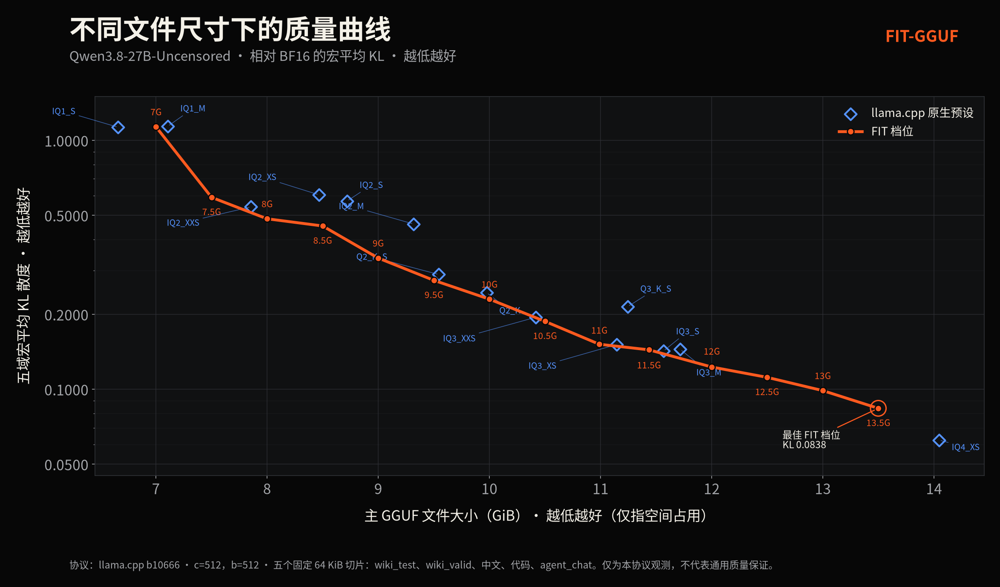

<p align="center">
  <a href="README.md">English</a> · <span>简体中文</span>
</p>

<p align="center">
  <picture>
    <source media="(prefers-color-scheme: dark)" srcset="branding/fit-gguf-logo-dark.svg">
    <source media="(prefers-color-scheme: light)" srcset="branding/fit-gguf-logo-light.svg">
    
  </picture>
</p>

<p align="center"><strong>FIT-GGUF：Fit-to-Size Intelligent Tensor Quantization for GGUF</strong></p>

<p align="center">
  一个确定性的规划层，把 llama.cpp 的量化预设变成近乎连续的模型体积控制。
</p>

## 简短版本

标准 GGUF 量化让你在预设里挑一个。FIT-GGUF 从"不超过目标字节数的最大受支持预设"出发，把剩余预算以确定性的张量级精度升级花出去。

> **传统 GGUF 给你预设，FIT 给你一个体积滑块。**

FIT-GGUF v0.1 有两条刻意分开的结论：

| 论断 | 状态 | 范围 |
| --- | --- | --- |
| 确定性的体积预测与配方执行 | **已验证** | 两个测试模型族的 22/22 个评估目标在固定工具链下实际体积与预测零字节误差；当前 14 档发布批次同样与 oracle 后预测完全一致。 |
| 普适最优的张量分配 | **未建立** | imatrix 引导的分配器在开发模型族上有帮助，但在第二个模型族上未能胜过匹配的随机分配。FIT 主张的是精确体积控制，不是普适质量最优。 |

"连续"指在可表达的 GGUF 配方空间内取任意目标体积。张量/量化类型的切换是离散的，因此可能残留少量目标富余；预测器必须与实际产物一致，而不假装每个字节目标都能精确落点。

## 首发批次：Qwen3.8-27B-Uncensored

首批公开发布包含 **14 个 FIT 档位（7 GiB 至 13.5 GiB，每 0.5 GiB 一档）**，基模型为
[`orcarouter/Qwen3.8-27B-Uncensored`](https://huggingface.co/orcarouter/Qwen3.8-27B-Uncensored)。
每个档位都附带规划记录、有效配方、张量覆盖文件、实测的五域 KL/Same-top 结果与 SHA-256 溯源。



[中文图表](docs/assets/kl-curve-zh.png) · [English chart](docs/assets/kl-curve-en.png)

这条曲线是该模型在该协议下的实测观察，不是普适保证。P5 把 12.5-13.5G 的 K 系跨度替换为 IQ3_M→IQ4_XS 跨度，P6 修复了 8-10G 的跨度。最终实测的 FIT 曲线在全部 14 个发布档位上单调；被替换的旧配方作为实验证据保留。

更多发布图表：

- Same-top 一致率：[中文](docs/assets/sametop-curve-zh.png) · [English](docs/assets/sametop-curve-en.png)
- 旧配方到最终配方的分配对比：[中文](docs/assets/strategy-improvement-zh.png) · [English](docs/assets/strategy-improvement-en.png)
- 目标预算利用率：[中文](docs/assets/target-utilization-zh.png) · [English](docs/assets/target-utilization-en.png)
- 全标注曲线（14 个原生预设蓝点带档位名与引线）：[中文](docs/assets/labeled-curves-zh.png) · [English](docs/assets/labeled-curves-en.png)

## 安装

FIT-GGUF 需要 Python 3.11+ 和一个包含 `llama-quantize` 的兼容 llama.cpp 运行时。

```bash
python3 -m venv .venv
source .venv/bin/activate
python -m pip install -e '.[test]'
python -m pytest tests/
```

Python 包本身除标准库外没有任何运行时依赖；真实分析与量化使用所提供的 llama.cpp 二进制。

## CLI 工作流

### 1. 分析源模型与预设区间

```bash
fit analyze \
  --source model-BF16.gguf \
  --imatrix imatrix.gguf \
  --runtime /path/to/llama.cpp/bin \
  --lower IQ3_M \
  --upper IQ4_XS \
  --out-dir work/analysis
```

`analyze` 用固定的 `llama-quantize --dry-run` 捕获有效预设配方、分析 imatrix 剖面、推导 GGUF 元数据，并冻结候选集。

### 2. 规划明确的字节目标

```bash
fit plan \
  --analysis work/analysis/analysis.json \
  --target-bytes 12884901888 \
  --policy balanced \
  --model-name MyModel \
  --out-prefix work/MyModel-FIT-12G
```

这一步写出规划记录、有效配方和 `--tensor-type-file`。对固定输入、策略与工具链，规划是完全确定性的。

### 3. 量化并强制校验预测

```bash
fit quantize \
  --analysis work/analysis/analysis.json \
  --tensor-types work/MyModel-FIT-12G-tensor-types.txt \
  --out MyModel-FIT-12G.gguf \
  --expect-bytes PREDICTED_BYTES_FROM_THE_PLAN
```

命令会拒绝尺寸不匹配的输出，并记录产物 SHA-256。

## 工作原理

1. **锚定** — 选择预测体积不超过预算的最大受支持低档预设。
2. **测量** — 从真实源模型与工具链推导张量形状、有效量化类型、编码字节增量与 imatrix 统计。
3. **分配** — 对安全的正向精度迁移排序，在剩余字节预算内用冻结的策略打包。
4. **询问 oracle** — 把拟议的张量覆盖文件通过 llama.cpp 干跑重放，使基于计数器的预设规则反映进最终有效配方。
5. **验证** — 量化，核对产物字节数与 oracle 预测，并计算哈希。

这个架构之所以重要，是因为 llama.cpp 预设是"配方"，不是把单一量化类型均匀套到每个张量上。

## 证据与可复现性

- `FINAL_REPORT.md` — v0.1 结论、已接受与被拒绝的论断。
- `experiments/` — M0-M16 与产品化阶段的冻结实验输入、门禁、日志与机器可读结果。
- `experiments/2026-08-29-p4-release-batch/` — 首个 14 档发布批次。
- `src/fit_gguf/` — 解析器、GGUF 体积模型、imatrix 剖面、规划器、优化器与 CLI。
- `tests/` — 确定性的单元与集成级测试覆盖。

已发布的测量使用 llama.cpp b10666（`4e97ac86e`）、Linux x86_64、ROCm、512 token 上下文、512 batch、对齐 BF16 参照，以及五个固定的 64 KiB 切片（`wiki_test`、`wiki_valid`、中文、代码、`agent_chat`）。KL 与 Same-top 是主要的方向性指标；短语料 PPL 仅作诊断。

## 边界与声明

- `FIT-12G` 这类文件名描述的是**主 GGUF 文件的目标预算**，不是内存或显存总占用。KV cache、计算缓冲、运行时开销与多模态投影器都是额外开销。
- 精确预测只在固定工具链范围内成立。更换 llama.cpp、转换器行为、元数据、源模型布局或平台后都需要重新验证。
- 质量单调性是测试曲线上的观察，不是规划器强制的不变量。跨度边界上的倒退可能出现，必须保持可见。
- balanced v0.1b 分配器是文档化的发布选择，不是跨模型定理；它的迁移失败记录保留在 `FINAL_REPORT.md`。
- 当前优化器只在选定的低/高档预设区间内做只升不降的调整，不是无约束的全局 qtype 搜索。

## 项目记录

- `DECISIONS.md` — 已接受与已拒绝的设计决策（D-0001..D-0024）。
- `FINAL_REPORT.md` — v0.1 研究报告及其已验证论断。
- `docs/llama-integration.md` — 对 llama.cpp 集成路径的核查记录。
- `eval-data/PROVENANCE.md` — 五个预注册 KL 评测切片的来源、偏移与 SHA-256。
- `experiments/` — 预注册实验记录（门禁先于执行冻结，结果如实记录）。

## 许可证

MIT — 见 [LICENSE](LICENSE)。发布的基模型
（`orcarouter/Qwen3.8-27B-Uncensored`）有自己的许可条款；发布的 FIT 量化产物继承该模型的使用限制。
